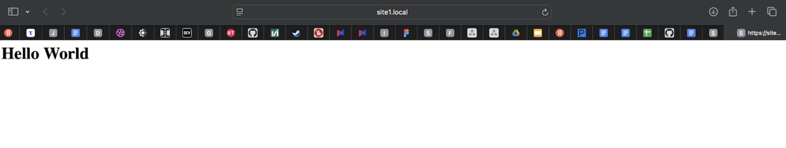
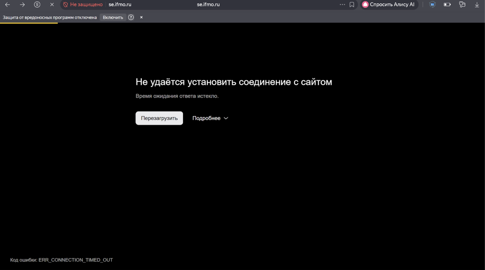

# Лабораторная работа 1 и 1*

# Лабораторная работа 1
## Настройка Nginx и HTTPS с виртуальными хостами

---

## Цель работы
Настроить веб-сервер Nginx так, чтобы:
- Он обслуживал два pet-проекта по HTTPS.
- Обеспечивал перенаправление с HTTP на HTTPS (порт 80 → 443).
- Использовал alias для псевдонимов путей.
- Разграничивал проекты по доменным именам (виртуальные хосты).

---

## Установка и запуск Nginx на macOS (через Homebrew)

### Команды:

    brew install nginx
    brew services start nginx

	brew install nginx — устанавливает Nginx.
    brew services start nginx — запускает его как фоновый сервис.

Проверка:

    nginx -t
    brew services list
    lsof -i -n -P | grep nginx

	nginx -t — проверяет корректность конфигурации.
	lsof — проверяет, какие порты слушает Nginx (8080, 80, 443).

---

Настройка HTML-страниц

Созданы директории и минимальные данные в index.html:

    BREW="$(brew --prefix)"
    mkdir -p "$BREW/var/www/site1/html" "$BREW/var/www/site2/html"

    echo "<h1>Hello World</h1>"  > "$BREW/var/www/site1/html/index.html"
    echo "<h1>Hello DevOps</h1>" > "$BREW/var/www/site2/html/index.html"

---

Настройка alias

    mkdir -p "$BREW/var/www/site1/assets_src"
    echo "asset ok" > "$BREW/var/www/site1/assets_src/info.txt"

---

Настройка HTTPS

Установлен mkcert и сгенерированы локальные сертификаты.
Это нужно, чтобы браузер доверял HTTPS для локальных доменов.

Команды:

    mkcert -install
    
    mkcert -cert-file "$CERT_DIR/site1.local.pem" \
           -key-file "$CERT_DIR/site1.local-key.pem" \
           site1.local localhost 127.0.0.1 ::1
    
    mkcert -cert-file "$CERT_DIR/site2.local.pem" \
           -key-file "$CERT_DIR/site2.local-key.pem" \
           site2.local localhost 127.0.0.1 ::1

---

Локальные домены

    sudo sh -c 'printf "\n127.0.0.1 site1.local\n127.0.0.1 site2.local\n" >> /etc/hosts'

Это позволяет браузеру открывать:
	https://site1.local
	https://site2.local

---

Конфигурация виртуальных хостов

Созданы файлы:

    sudo touch /opt/homebrew/etc/nginx/servers/site1.conf
    sudo chown rafael:admin /opt/homebrew/etc/nginx/servers/site1.conf

---

Конфигурация site1.conf

    server {
        listen 80;
        server_name site1.local;
        return 301 https://$host$request_uri;
    }
    
    server {
        listen 443 ssl;
        server_name site1.local;
    
        ssl_certificate      /opt/homebrew/etc/nginx/certs/site1.local.pem;
        ssl_certificate_key  /opt/homebrew/etc/nginx/certs/site1.local-key.pem;
    
        root /opt/homebrew/var/www/site1/html;
        index index.html;
    
        location /assets/ {
            alias /opt/homebrew/var/www/site1/assets_src/;
            autoindex off;
            try_files $uri $uri/ =404;
        }
    
        location / {
            proxy_pass http://127.0.0.1:9000;
            proxy_set_header Host              $host;
            proxy_set_header X-Real-IP         $remote_addr;
            proxy_set_header X-Forwarded-For   $proxy_add_x_forwarded_for;
            proxy_set_header X-Forwarded-Proto $scheme;
        }
    }

---

Проверка

    curl -I http://site1.local
    curl -I https://site1.local
    curl -I https://site2.local
    open https://site1.local

Скриншот результата

---

## Лабораторная работа 1*

По началу я даже не знал с чего начать и что мне делать, и потому решил обратиться к ChatGPT.
Естественно GPT отказался мне помогать взламывать сайты. После нескольких добрых и высоконравственных словосочетаний в адрес нейросети я попросил дать хотя бы инструменты для взлома site1.local.
Ответом стал ffuf, так как это является простым и интересным способом (и действительно так).

Для взлома возьмём сайт Факультета программной инженерии и компьютерной техники:

https://se.ifmo.ru 

http://helios.cs.ifmo.ru

    ffuf -u http://helios.cs.ifmo.ru/FUZZ -w raft-small-words.txt -mc 200,302,403

    ffuf -u https://se.ifmo.ru/FUZZ -w raft-small-words.txt -mc 200,302,403

Пример вывода (фрагмент):

    installation   [Status: 200]
    user           [Status: 302]
    forum          [Status: 200]
    cgi-bin        [Status: 200]
    search         [Status: 200]
    download       [Status: 200]
    profile        [Status: 200]
    bin            [Status: 200]
    category       [Status: 200]
    password       [Status: 200]
    ...
    database       [Status: 200]

И так удалось зайти на внутренние страницы сайта.
Когда я попытался зайти на какой-нибудь из доступных, сайт лёг:

---

Поэтому я решил не ждать и пошёл на https://fitp.itmo.ru/.
Очень интересно, что там можно найти.

Но ничего интересного найдено не было.
Все страницы перебрасывали либо на начальный экран, либо на авторизацию.
Только:

https://fitp.itmo.ru/Profile

ведёт в пустую страницу.

---

Далее я решил взломать сайт КТ ИТМО: https://ct.itmo.ru/

    ffuf -u https://ct.itmo.ru/FUZZ \
         -w raft-small-words.txt \
         -mc 200,302,403

Получился огромный вывод — проверять всё нереально.
Но при попытке зайти на любые найденные пути сайт завис.
После чего перестал открываться вообще.

Таким образом удалось взломать se.ifmo и получить большое количество пустых, старых и скрытых страниц, которые нельзя получить обычным образом.

